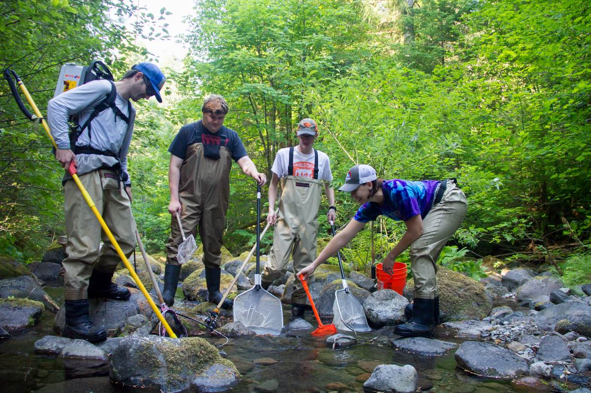
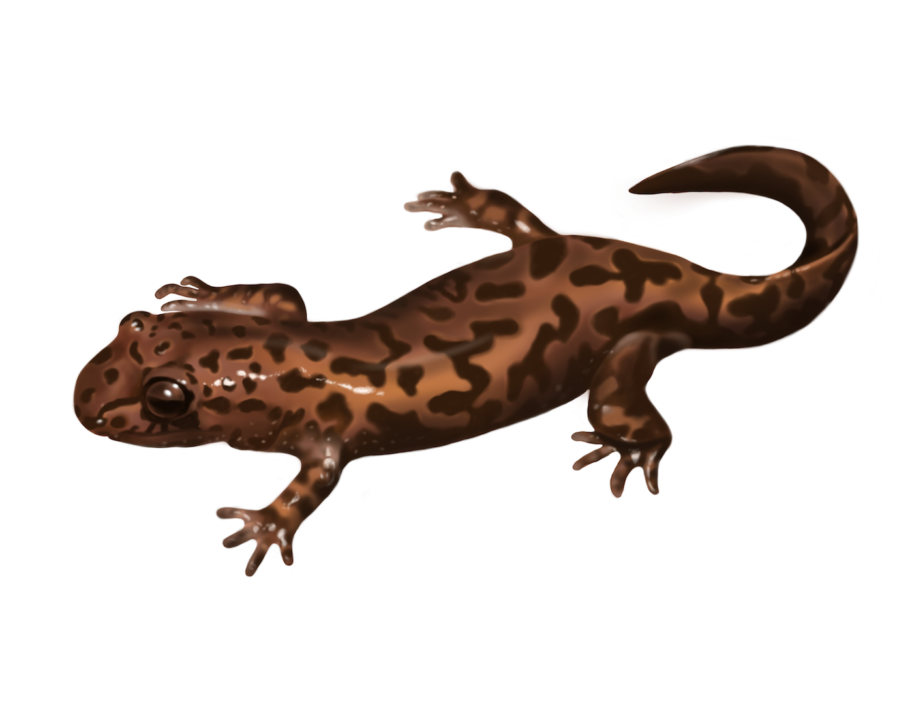

```{r setup, include=FALSE}
knitr::opts_chunk$set(echo = FALSE, message = FALSE)
```

### Introduction
<center> {width=700px}</center>  
**Figure 1:** Sampling Mack Creek Fish and Pacific Giant Salamander in Mack Creek, Oregon. Photo Credit: [HJ Andrews Experimental Forest LTER](https://andrewsforest.oregonstate.edu/gallery/forest-and-stream-research-pollinator-field-work-and-meadow-views-2015-2016) 

Pacific Giant Salamander... 

<center> {width=500px}</center>  
**Figure 2:** Pacific Giant Salamander. Photo Credit: [inPlume Design](http://www.inplumedesign.com/illustrations-2/omgw2e49cgh105hbkd525dd3xse1u7) 

```{r}
# Insert packages.

library(tidyverse)
library(janitor)
library(here)
library(colorspace)
library(tidyr)
library(nationalparkcolors)
library(effsize)
library(knitr)
library(kableExtra)

# Load in mack_creek_vertebrates.csv file and change header/column names to lowercase snakecase.

mack_creek_vertebrates <- read_csv("mack_creek_vertebrates.csv") %>% 
  clean_names()

```

### Data and Methods
<center> {width=700px}</center>  
**Figure 3:** HJ Andrews Experimental Forest Map. The study site for the data, Mack Creek, is located to the east of Lookout Mountain. Photo Credit: [HJ Andrews Experimental Forest LTER](https://andrewsforest.oregonstate.edu/data/map) 

### Results 
##### 1. Annual Salamander Counts in Old Growth (OG) and Clear Cut (CC) sections in Mack Creek.  
Annual Pacific Giant Salamander counts were compared in old growth and clear cut areas in Mack Creek. Confierous forests are located in old growth areas. Up until 2015, clear cut area sections in Mack Creek typically showed a lower count than in old growth sections. In 1995, Pacific Giant Salamander count declined by more than half than what was recorded in the previous year in 1994. However, count more than doubled from 1999 to 2000. The highest and lowest counts in both areas were 380 and 129 in old growth areas and 368 and 63 in clear cut areas.

<center>
```{r}
# Count salamanders in old growth and clear cut sections in Mack Creek for every year.
mc_vertebrates_counts <- mack_creek_vertebrates %>%
  filter(species == "DITE") %>% 
  count(year,section)

# Make a graph to visualize the counts. 
ggplot(data = mc_vertebrates_counts, aes(x = year, y = n, fill = section)) +
  geom_bar(stat = "identity") +
  coord_flip() +
  labs(title = "Annual Pacific Giant Salamander Counts in Mack Creek", x = "Year", y = "Number of Pacific Giant Salamander", fill = "Area Section") +
  theme_classic() +
  scale_fill_manual(values = park_palette(n = 2, name = "Yosemite"), labels = c("Clear Cut", "Old Growth")) + 
  theme(plot.title = element_text(hjust = 0.5), legend.position = c(.85,0.2)) + 
  theme(axis.title.y = element_text(margin = margin(t = 0, r = 15, b = 0, l = 15))) +
  theme(axis.title.x = element_text(margin = margin(t = 15, r = 0, b = 15, l = 0))) +
  scale_x_continuous(limits = c(1992, 2018), breaks = seq(1993, 2017, by = 2))
```
</center>  
**Figure 3:** Pacific Giant Salamander counts in Mack Creek for clear cut and old growth sections in 1993 to 2017. Data: Gregory S. V. 2016.  

##### 2. Annual Salamander Counts in Old Growth (OG) and Clear Cut (CC) sections in Mack Creek.  
**Table 1:** 
Pacific Giant Salamander in channel classifications and area sections in 2017. The channel classifications are cascade, pool, and side channel. The area sections are clear cut and old growth. Data: Gregory S. V. 2016.  

<center>
```{r}
# Count salamanders in 2017 in different channel classifications (pool,cascade, or side-channel) within old growth and clear cut area sections in Mack Creek. Make sure to exclude IP in unittype. 

mc_vertebrates_2017 <- mack_creek_vertebrates %>%
  select(year,section,unittype,species) %>% 
  filter(year == 2017) %>% 
  filter(unittype != "IP") %>%
  filter(species == "DITE") %>% 
  count(section, unittype)

# Create a contingency table showing porportions and counts of channel classifications and area sections in 2017. 

mc_vertebrates_2017_table <- mc_vertebrates_2017 %>% 
  pivot_wider(names_from = unittype, values_from = n)

# Create a table showing porportions from the contingency table.

mc_vertebrates_2017_table_knit <- mc_vertebrates_2017_table %>%
  adorn_percentages(denominator = "row") %>% 
  adorn_pct_formatting(digits = 0) %>% 
  adorn_ns(position = "front")

# Create a table showing porportions from the contingency table to show in the knitted document.

kable(mc_vertebrates_2017_table_knit, col.names = c("Area Section","Cascade","Pool","Side Channel"), caption = "Pacific Giant Salamander in Channels and Areas in 2017") %>%
  kable_styling(bootstrap_options = "striped", full_width = F) %>% 
  footnote(general ="", number = c("CC = Clear Cut", "OG = Old Growth"))
```
</center>  


##### 3. Finding the Difference in Where in the Channel Pacific Giant Salamanders are Located Between the Two Area Sections.
```{r}

# Create a contigency table of just counts for channel classification.
chi_counts <- mc_vertebrates_2017_table %>% 
  select(-section)

# Run a chi-square test for channel classification and area sections.
chi_test <- chisq.test(chi_counts)

chi_test
```

### Summary  

### References  
1. **Gregory S. V. 2016.** Aquatic Vertebrate Population Study in Mack Creek, Andrews Experimental Forest, 1987 to present. Environmental Data Initiative. https://doi.org/10.6073/pasta/5de64af9c11579266ef20da2ff32f702. Dataset accessed 11/19/2019.
